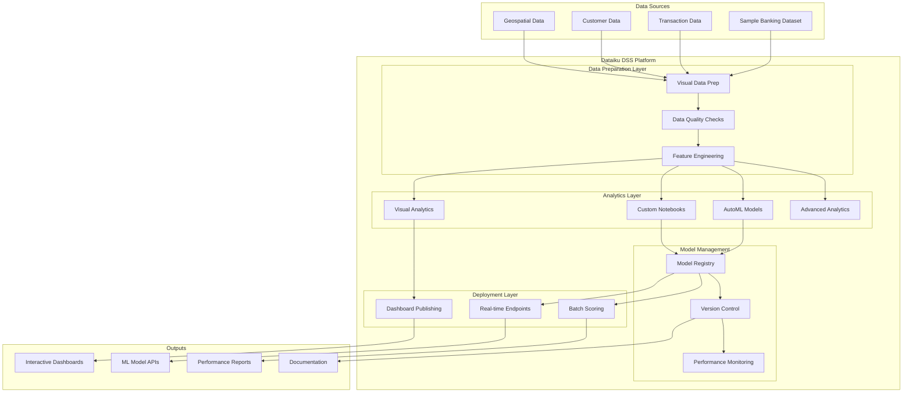

# Design Document

## Overview

This design outlines the technical implementation approach for validating 35 Data Science and Machine Learning test cases using Dataiku Data Science Studio (DSS). The solution leverages Dataiku's native capabilities including visual data preparation, AutoML, custom notebooks, model registry, and deployment features to demonstrate comprehensive analytics capabilities for a Philippine bank POC.

The implementation follows a phase-based approach over 6 weeks, building from basic data handling and visualization through advanced analytics and model governance. Each phase validates specific test cases while building the foundation for subsequent phases.

## Architecture

### High-Level Architecture



### Implementation Phases

**Phase 1: Data Foundation & Visualization (Week 1-2)**
- Data import and connection setup
- Visual data preparation and quality analysis
- Basic and advanced visualization creation
- Natural language summary generation

**Phase 2: Machine Learning Development (Week 2-3)**
- AutoML model training and evaluation
- Custom notebook-based model development
- Model performance assessment and comparison
- Prediction quality validation

**Phase 3: Advanced Analytics (Week 3-4)**
- Time series forecasting implementation
- Geospatial and graph analytics
- Statistical modeling and hypothesis testing
- NLP and text analysis capabilities

**Phase 4: Model Governance & Deployment (Week 4-5)**
- Model registry and versioning setup
- Real-time endpoint deployment
- Model monitoring and drift detection
- Performance reporting automation

**Phase 5: Integration & Validation (Week 5-6)**
- System integration testing
- Performance benchmarking
- Documentation and knowledge transfer
- Final validation of all test cases

## Components and Interfaces

### Data Management Components

**Data Connection Manager**
- Handles CSV, Excel, XML, and SQL data source connections
- Provides guided import interface with data preview
- Manages data source metadata and lineage tracking
- Interface: Dataiku's built-in connection management UI

**Data Quality Engine**
- Automated anomaly detection using Dataiku's data quality features
- Missing value identification and handling recommendations
- Data profiling and statistical summaries
- Interface: Visual data quality dashboard with alerts

**Feature Engineering Pipeline**
- Visual data preparation using Dataiku's prepare recipes
- Automated feature generation and selection
- Variable clustering and dimensionality reduction
- Interface: Drag-and-drop visual preparation interface

### Analytics and Modeling Components

**Visualization Engine**
- Chart creation using Dataiku's built-in charting capabilities
- Support for 10+ chart types including advanced visualizations
- Interactive dashboard creation with filtering and drill-down
- Interface: Visual chart builder with customization options

**AutoML Framework**
- Leverages Dataiku's AutoML plugin for automated model training
- Experiment tracking and model comparison leaderboard
- Automated hyperparameter tuning and feature selection
- Interface: AutoML wizard with progress tracking

**Custom Model Development**
- Jupyter notebook integration for custom model development
- Support for scikit-learn, pandas, and other ML libraries
- Model artifact management and versioning
- Interface: Integrated Jupyter notebooks with Dataiku context

**Advanced Analytics Suite**
- Time series forecasting using built-in or custom functions
- Geospatial analysis with spatial data types and functions
- Graph analytics using network analysis capabilities
- Interface: Specialized recipe types and notebook implementations

### Model Management Components

**Model Registry**
- Centralized model catalog with metadata management
- Performance metrics tracking (accuracy, AUC, precision, recall)
- Model comparison and champion model selection
- Interface: Model registry UI with search and filtering

**Version Control System**
- Model versioning with development phase labels
- Documentation and change tracking for each version
- Rollback and promotion capabilities
- Interface: Version management UI with approval workflows

**Monitoring and Alerting**
- Data drift detection using statistical tests
- Model performance degradation alerts
- Real-time monitoring dashboards
- Interface: Monitoring dashboard with configurable alerts

### Deployment Components

**Real-time Inference Engine**
- Model deployment as REST API endpoints
- JSON payload processing with sub-500ms latency
- Scalable inference with load balancing
- Interface: API endpoint management with testing tools

**Batch Scoring System**
- Large-scale batch prediction processing
- Scheduled scoring jobs with result storage
- Performance optimization for high-volume data
- Interface: Batch job scheduler with monitoring

**Dashboard Publishing**
- Interactive dashboard deployment
- Role-based access control and sharing
- Automated report generation and distribution
- Interface: Dashboard publishing wizard with access controls

## Data Models

### Core Data Entities

**Customer Entity**
```
Customer {
  customer_id: String (Primary Key)
  name: String
  age: Integer
  location: GeoPoint
  account_type: String
  risk_profile: String
  created_date: DateTime
  last_activity: DateTime
}
```

**Transaction Entity**
```
Transaction {
  transaction_id: String (Primary Key)
  customer_id: String (Foreign Key)
  amount: Decimal
  transaction_type: String
  timestamp: DateTime
  channel: String
  location: GeoPoint
  fraud_score: Decimal
}
```

**Model Metadata Entity**
```
ModelMetadata {
  model_id: String (Primary Key)
  model_name: String
  version: String
  algorithm_type: String
  performance_metrics: JSON
  training_date: DateTime
  status: String
  deployment_endpoint: String
}
```

### Dataset Requirements

**Primary Dataset: Banking Customer Analytics**
- Customer demographics and account information
- Transaction history with timestamps and amounts
- Geographic data for location-based analysis
- Risk indicators and fraud labels for supervised learning

**Recommended Dataset Sources:**
1. **Kaggle: Bank Customer Churn Dataset** - Customer demographics, account details, churn labels
2. **Kaggle: Credit Card Fraud Detection** - Transaction data with fraud indicators
3. **Generated Synthetic Data** - Time series transaction data for forecasting
4. **OpenStreetMap Data** - Geographic boundaries for geospatial analysis

This approach minimizes dataset complexity while covering all test case requirements through a unified banking domain context.

## Error Handling

### Data Processing Errors

**Data Import Failures**
- Validation of file formats and schema compliance
- Graceful handling of malformed data with user notifications
- Automatic data type inference with manual override options
- Logging of import errors with suggested corrections

**Data Quality Issues**
- Automated detection of missing values, outliers, and inconsistencies
- Configurable thresholds for data quality alerts
- Suggested remediation actions (imputation, removal, flagging)
- Quality score calculation and trend monitoring

**Feature Engineering Errors**
- Validation of transformation logic and data types
- Handling of edge cases in mathematical operations
- Memory management for large dataset transformations
- Rollback capabilities for failed transformation steps

### Model Development Errors

**Training Failures**
- Resource allocation monitoring and optimization
- Convergence detection and early stopping
- Hyperparameter validation and constraint checking
- Detailed error logging with debugging information

**Evaluation Errors**
- Validation of test data compatibility
- Handling of class imbalance and edge cases
- Metric calculation error detection and correction
- Performance threshold validation and alerting

**Deployment Errors**
- Model artifact validation before deployment
- API endpoint health checking and monitoring
- Load balancing and failover mechanisms
- Version rollback procedures for failed deployments

### System Integration Errors

**Performance Issues**
- Query optimization and resource monitoring
- Timeout handling for long-running operations
- Memory management and garbage collection
- Load balancing and scaling mechanisms

**Access Control Errors**
- Authentication and authorization validation
- Role-based permission enforcement
- Audit logging for security compliance
- Session management and timeout handling

## Testing Strategy

### Unit Testing Approach

**Data Processing Tests**
- Validation of data import and transformation functions
- Edge case testing for data quality checks
- Performance testing for large dataset operations
- Integration testing with various data sources

**Model Development Tests**
- Algorithm implementation validation
- Performance metric calculation accuracy
- Model serialization and deserialization
- Cross-validation and holdout testing

**API Endpoint Tests**
- Request/response format validation
- Latency and throughput performance testing
- Error handling and edge case scenarios
- Security and authentication testing

### Property-Based Testing Integration

Property-based testing will validate universal correctness properties across the entire system using generated test data and scenarios.

## Correctness Properties

*A property is a characteristic or behavior that should hold true across all valid executions of a system—essentially, a formal statement about what the system should do. Properties serve as the bridge between human-readable specifications and machine-verifiable correctness guarantees.*

### Data Import and Integration Properties

**Property 1: Multi-format Data Import Consistency**
*For any* valid data file in CSV, Excel, XML, or SQL format, importing the file should successfully parse the data and preserve all original data relationships and types
**Validates: Requirements 1.1, 3.4**

**Property 2: Data Quality Detection Completeness**
*For any* dataset containing known anomalies, missing values, or inconsistencies, the platform should detect and flag all quality issues without false negatives
**Validates: Requirements 1.5, 8.1**

**Property 3: Referential Integrity Preservation**
*For any* set of related tables with defined foreign key relationships, joining the tables should maintain referential integrity with no orphaned records
**Validates: Requirements 3.3, 8.2**

### Visualization and User Interface Properties

**Property 4: Visualization Creation Efficiency**
*For any* dataset and chart type combination, creating a visualization should require no more than 5 user interaction steps
**Validates: Requirements 1.3**

**Property 5: ETL Script Generation Correctness**
*For any* high-level data processing requirement, the generated ETL script should be syntactically correct and executable without manual modification
**Validates: Requirements 3.5**

### Machine Learning Model Properties

**Property 6: AutoML Experiment Completeness**
*For any* prepared dataset suitable for machine learning, the AutoML process should complete preprocessing, run multiple experiments, and produce a ranked leaderboard of models
**Validates: Requirements 2.2**

**Property 7: Model Performance Metric Accuracy**
*For any* trained model with ground truth labels, calculated performance metrics (accuracy, precision, recall, F1-score, AUC) should match mathematically correct values within acceptable tolerance
**Validates: Requirements 2.5**

**Property 8: Train-Test Split Consistency**
*For any* dataset and specified split ratio, the resulting training and test sets should maintain the exact ratio and contain no overlapping records
**Validates: Requirements 2.4**

### Advanced Analytics Properties

**Property 9: Geospatial Query Accuracy**
*For any* point-in-polygon query with known geometric relationships, the spatial functions should return correct containment results for all test points
**Validates: Requirements 4.2**

**Property 10: Graph Analytics Correctness**
*For any* network graph with known centrality characteristics, PageRank calculations should identify the most central nodes according to the algorithm's mathematical definition
**Validates: Requirements 4.3**

**Property 11: Statistical Analysis Validity**
*For any* dataset with known statistical properties, linear regression, correlation analysis, and hypothesis testing should produce results consistent with statistical theory
**Validates: Requirements 4.4**

**Property 12: Scenario Modeling Responsiveness**
*For any* parameter adjustment in what-if analysis, the system should update results to reflect the parameter changes according to the underlying model relationships
**Validates: Requirements 4.5**

### Model Management Properties

**Property 13: Model Metadata Completeness**
*For any* trained model, the model registry should store all specified metadata including predictive power, AUC, goodness of fit, and user-defined metrics
**Validates: Requirements 5.1**

**Property 14: Champion Model Selection Accuracy**
*For any* set of models with defined performance criteria, the system should correctly identify and highlight the highest-performing model as the champion
**Validates: Requirements 5.2**

**Property 15: Model Version Control Integrity**
*For any* model version saved with development phase labels, the versioning system should maintain complete traceability and allow restoration of any previous version
**Validates: Requirements 5.3, 5.4**

**Property 16: Data Drift Detection Sensitivity**
*For any* data stream with intentionally altered distribution characteristics, the monitoring system should detect the drift and flag the appropriate time windows
**Validates: Requirements 5.6, 8.3**

### System Performance Properties

**Property 17: Real-time Inference Latency**
*For any* deployed model receiving JSON prediction requests, the API should return responses within 500ms latency under normal load conditions
**Validates: Requirements 7.2**

**Property 18: Search Query Accuracy**
*For any* complex search query with filters, keywords, and logical operators, the system should return results that match all specified criteria
**Validates: Requirements 7.4**

**Property 19: Role-based Access Control Enforcement**
*For any* user with defined role permissions, the system should enforce access restrictions correctly, allowing only authorized actions on models and reports
**Validates: Requirements 7.6**

### Data Processing Properties

**Property 20: Variable Clustering Consistency**
*For any* feature set with known relationships, variable clustering should group related features together and provide meaningful cluster metadata
**Validates: Requirements 3.2**

**Property 21: Usage Metrics Tracking Accuracy**
*For any* model or report access event, the system should accurately track and report usage metrics including access frequency, downloads, and unique users
**Validates: Requirements 6.5**

**Property 22: Data Lineage Completeness**
*For any* data transformation pipeline, the system should maintain complete processing history and track all transformation steps for audit purposes
**Validates: Requirements 8.6**

### Property Reflection

After reviewing all identified properties, several consolidations were made to eliminate redundancy:

- **Data Quality Properties (1.5, 8.1)** were combined into Property 2 as they test the same underlying capability
- **Referential Integrity Properties (3.3, 8.2)** were combined into Property 3 as they validate the same data relationship preservation
- **Drift Detection Properties (5.6, 8.3)** were combined into Property 16 as they test the same monitoring functionality
- **Performance Properties** were kept separate as they test different aspects (latency vs. search accuracy vs. access control)

Each remaining property provides unique validation value and tests distinct system capabilities without logical redundancy.

## Testing Strategy

### Dual Testing Approach

The testing strategy employs both unit tests and property-based tests as complementary approaches:

**Unit Tests** focus on:
- Specific examples demonstrating correct behavior
- Edge cases and error conditions  
- Integration points between Dataiku components
- Validation of specific test case requirements

**Property-Based Tests** focus on:
- Universal properties that hold across all inputs
- Comprehensive input coverage through randomization
- Validation of correctness properties defined above
- Systematic exploration of the input space

### Property-Based Testing Configuration

**Framework Selection**: pytest-hypothesis for Python-based testing within Dataiku notebooks
**Test Configuration**: Minimum 100 iterations per property test to ensure comprehensive coverage
**Test Tagging**: Each property test must reference its design document property using the format:
```python
# Feature: dataiku-data-science-poc, Property 1: Multi-format Data Import Consistency
```

**Implementation Approach**:
- Property tests will be implemented as Dataiku notebook cells
- Each correctness property maps to exactly one property-based test
- Tests will generate synthetic data matching banking domain requirements
- Validation will occur within Dataiku's execution environment

### Test Data Strategy

**Primary Test Dataset**: Synthetic banking data generated to cover all test scenarios
- Customer demographics with varied profiles
- Transaction histories with temporal patterns
- Geographic data for spatial analysis
- Labeled data for supervised learning validation

**Property Test Generators**:
- Smart generators that constrain inputs to valid business ranges
- Temporal data generators for time series testing
- Geospatial coordinate generators for location-based testing
- Network structure generators for graph analytics testing

This testing approach ensures comprehensive validation of all 35 test cases while maintaining focus on Dataiku's native capabilities and banking domain requirements.